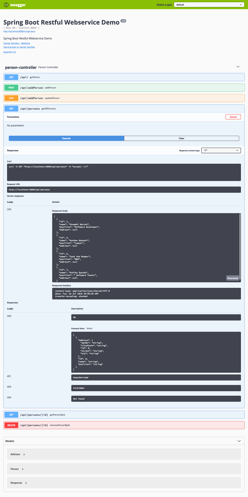
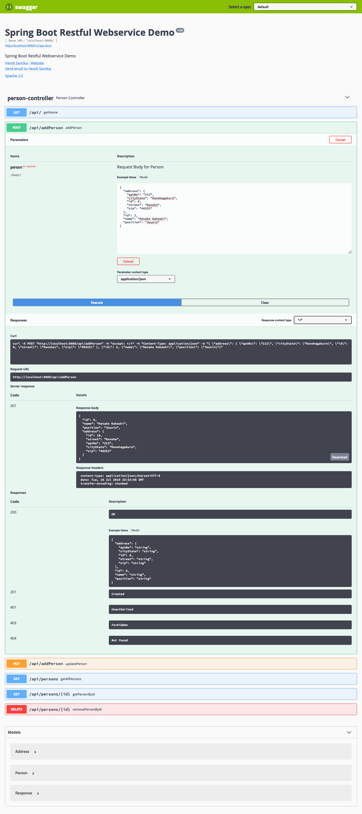
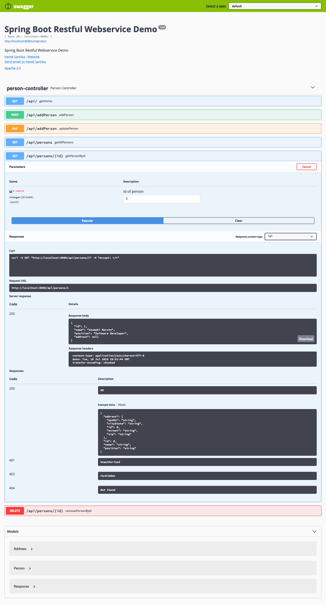
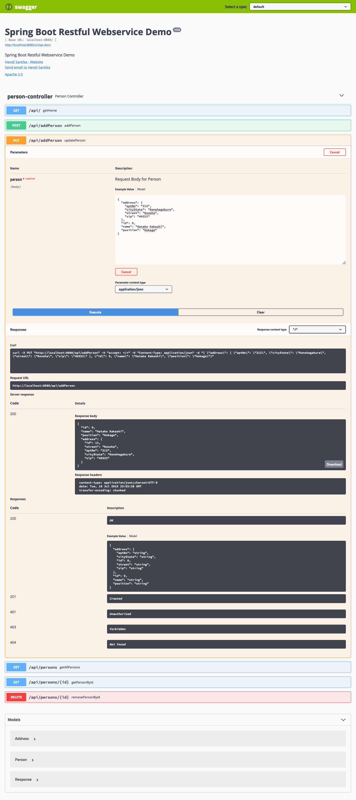
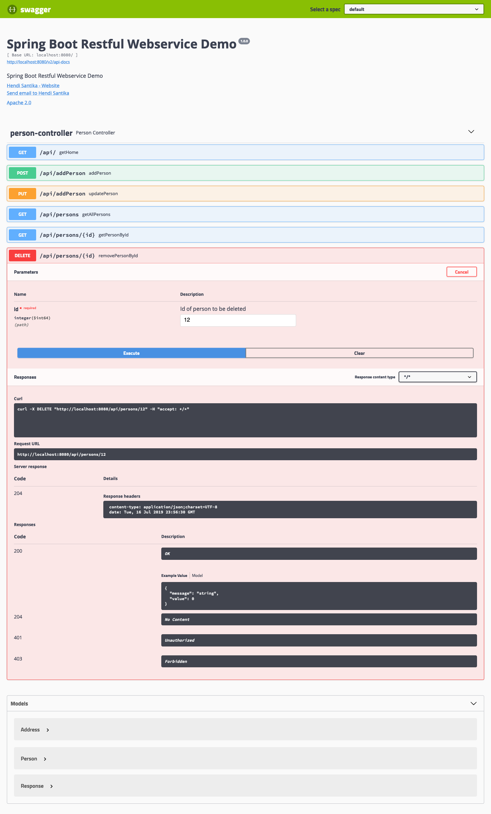

# springboot-restful-webservice-demo

## Things to do:
1. Clone the repository:
    `git clone https://github.com/hendisantika/springboot-restful-webservice-demo.git`
2. Go to the folders: `cd springboot-restful-webservice-demo`
3. Run the application: `mvn clean spring-boot:run`

## Screen shot

**Get All Persons **   

**Add New Person**

**Get Person By Id**

**Update Person By Id**

**Delete Person By Id**

